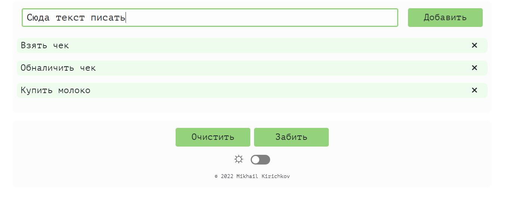
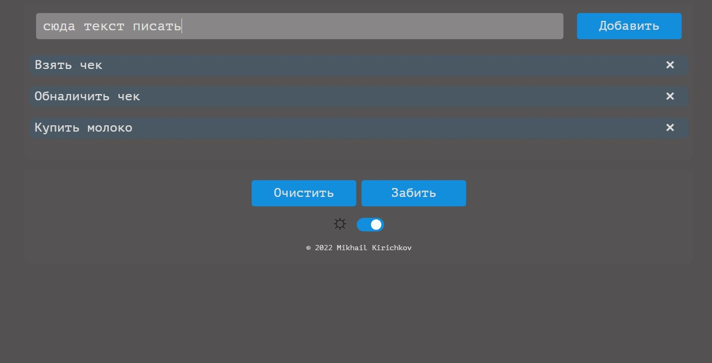

# ToDo List
_______________

## Описание
Небольшая ТуДушка.
Стек:
-HTML/SCSS,
-JavaScript

Реализовано добавление пунктов, их удаление, кнопка "очистить", кнопка "забить" (удаляет все пункты на сегодня, добавляет вместо них несколько шутливых), переключение тем (ночь-день).

  
  

______

## Необходимые доработки:
1) Адаптив под разные разрешения
2) Добавление пунктов в localstorage

______
## Ссылка на проект

https://ihomeeer.github.io/ToDoList/
